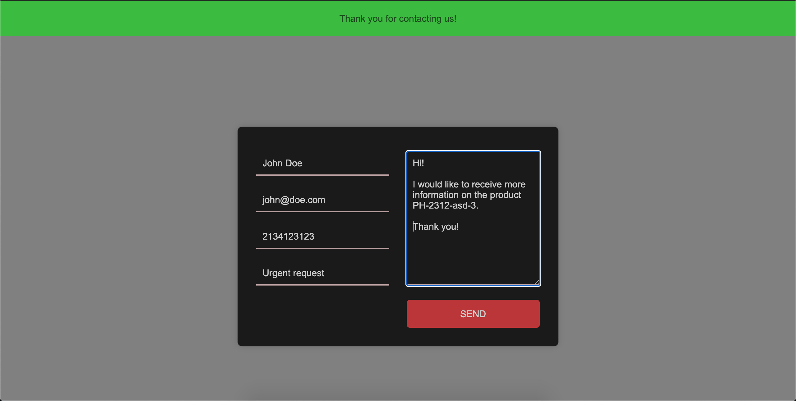

# Landing Page Contact form

An application used as an example to show how you can make a landing page with
a contact form using Ruby on Rails.

Once the contact form is submitted an email is sent through Gmail account,
to the email address filled in the form.




## Getting started

Before you try to run the application make sure you
* have a Ruby version `2.7.1` installed
* have PostgreSQL driver `pg` installed

To install specific version of Ruby you can use [RVM](https://rvm.io/) or [rbenv](https://github.com/rbenv/rbenv).
### Creating database role
First, you must create the PostgreSQL role that will be used to create and
manage the application's database.

Within the PostgreSQL interactive terminal, type the following:
```
create role landing_page_contact_form with createdb login password '<your-password>';
```
This statement will create a role `landing_page_contact_form` with abilities to login, create a
database and with the password you provide.

### Setting an DB password environment variable

If you take a look at the file `config/database.yml` there is a section named `default` where the `password`
key has been set to
```
<%= ENV['LANDING_PAGE_CONTACT_FORM_DATABASE_PASSWORD'] %>
```

This means that the environment must contain a variable named `LANDING_PAGE_CONTACT_FORM_DATABASE_PASSWORD`.

To achieve that we can add this line within the startup file of your shell (`.bashrc`, `.zshrc` or similar file depending on the shell you use):
```
export LANDING_PAGE_CONTACT_FORM_DATABASE_PASSWORD=<your-password>
```

### Installing gems

While being in the project directory, execute
```
bundle install
```
to install gems from the `Gemfile`.

### Preparing database

There is one step left before we can run the application server - we must prepare our database.
To do that run the rake tasks with the command
```
rake db:create db:migrate db:seed
```

### Configuring for Gmail account

To get the mailer working you need to setup two environment variables:
```
LANDING_PAGE_CONTACT_FORM_GMAIL_USERNAME
LANDING_PAGE_CONTACT_FORM_GMAIL_PASSWORD
```

Refer to `Setting an DB password environment variable` section above on how to
do that.

If your Gmail account has two factor authentication then you must [create an
app password](https://support.google.com/mail/answer/185833?hl=en-GB) and use the
generated password in the `LANDING_PAGE_CONTACT_FORM_GMAIL_PASSWORD` variable.

This will allow to send emails from the account you connect to the email address that
is submitted in the contact form.

WARNING: current setup (in development environment) will send email on every contact form submission.

### Starting application server

To start the application server run
```
rails s
```

By default the application will be accessible on `localhost:3000/`.
